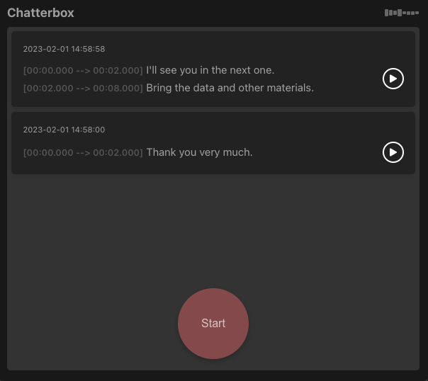

<h1 align="center">openai-chatterbox</h1>
<p align="center">
A sample Nuxt 3 application that listens to chatter in the background and transcribes it using the powerful OpenAI Whisper, an automatic speech recognition (ASR) system.
</p>
<br />
<p align="center">
「Nuxt 3アプリケーションのサンプルで、背景のチャタリングをリスニングし、強力なOpenAI Whisperという自動音声認識システムを使ってトランスクリプトします。」
</p>

---

<p align="center">
  
</p>

---

# Motivation

This is the [Nuxt.js](https://nuxt.com/docs/getting-started/introduction) version of the [openai-whisper](https://github.com/supershaneski/openai-whisper) project I built using [Next.js](https://nextjs.org/docs/getting-started), and is part of the series of projects to learn more about `Vue 3` and `Next 3`. I made some improvements in audio data capture and simplified the user interface.

# Audio Capture

To start audio capture, press the `Start` button first.

However, please note that it will not start recording immediately.
Recording will automatically begin only if sound is detected.

There is a threshold setting to eliminate background noise from triggering the audio capture. 
By default it is set to `-45dB` (0dB is the loudest sound). 
Adjust the variable `MIN_DECIBELS` if you want to set it to lower or higher depending on your needs.

In normal human conversation, it is said that we tend to pause, on average, around 2 seconds between each sentences. Keeping this in mind, if sound is not detected for more than 2 seconds, recording will stop and the audio data will be sent to the backend for transcribing.
You can change this by editing the value of `MAX_PAUSE`, by default set to `2500ms`.

Press the `Stop` button once again to stop recording.
This will also stop transcribing the audio data currently not yet finished.
If you do not want this behavior, edit the line of codes for `AbortController`.

Not all uploaded audio data will contain voice data.
Only audio data that are successfully transcribed will be shown in the list.
It is possible to verify the accuracy of the transcription by pressing the `Play` button to play the recorded audio data.


# OpenAI Whisper

Transcribing of audio data is done by [OpenAI Whisper](https://github.com/openai/whisper) and it takes time so do not expect `real-time` transcription or translation.
I have set the `model` to `tiny` to adapt to my developing circumstance but if you find that your machine is faster, set it to [other models](https://github.com/openai/whisper#available-models-and-languages) for improved voice transcription.

If the audio source can contain other languages aside from English, you need to set the `language` option and set the `task` option to `translate`.

```sh
$ whisper audio.ogg --language Japanese --task translate --model tiny --output_dir './public/upload'
```

The output will consist of 3 files (srt, txt, vtt) and will be saved in the output directory.
If you use the app for very long time, you might see exponential increase of number of files in the output directory.
The app do not actually need these. However, it seems there is no option to prevent `Whisper` from outputting these files.

Anyway, you might be interested in other configuration options using `Whisper` so please check `whisper --help`.


# Nuxt.js/Vue.js

Currently, I am using the basic `fetch` to send audio data to the API endpoint and it can cause blocking. I am planning to change it and use `useLazyFetch` instead later on to see if there is any improvement.


# Installation

First, you need to install [`Whisper`](https://github.com/openai/whisper) and its `Python` dependencies

```sh
$ pip install git+https://github.com/openai/whisper.git
```

You also need `ffmpeg` installed on your system

```sh
# macos
$ brew install ffmpeg

# windows using chocolatey
$ choco install ffmpeg

# windows using scoop
$ scoop install ffmpeg
```

By this time, you can test `Whisper` using command line

```sh
$ whisper myaudiofile.ogg --language English --task translate
```

You can find sample audio files for testing from [here](https://commons.wikimedia.org/wiki/Category:Audio_files_of_speeches).

If that is successful, you can proceed to install this app.

Clone the repository and install the dependencies

```sh
$ git clone https://github.com/supershaneski/openai-chatterbox.git myproject

$ cd myproject

$ npm install
```

To run the app

```sh
$ npm run dev
```

Open your browser to `http://localhost:5000/` (port number depends on availability) to load the application page.


# Using HTTPS

You might want to run this app using `https` protocol.
This is needed to enable audio capture using a separate device like a smartphone.

In order to do so, prepare the proper `certificate` and `key` files and edit `server.mjs` at the root directory.

Then buid the project

```sh
$ npm run build
```

Finally, run the app

```sh
$ node server.mjs
```

Now, open your browser to `https://localhost:3000/` (port number depends on availability) or use your local IP address to load the page.


# Known Issues

If you encounter an error that says **`__dirname` is not found** (seem to be related to `formidable`) when you run `npm run dev`, please run the `build` command.

```sh
$ npm run build
```

Then try to run the app again

```sh
$ npm run dev
```

